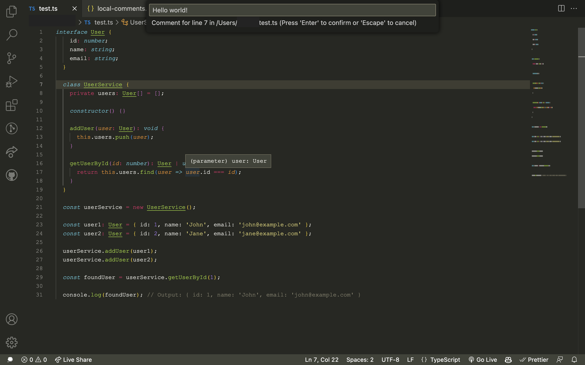
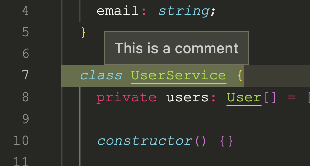
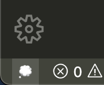

# Local Comments

This extension allows you to add comments to specific lines of code in a file, without modifying the code file itself. The comments are saved to a JSON file in your user root folder.

## Features

- Add comments to specific lines of code in a file.
- Indicator on the line in the editor that it has a comment.
- Input box to add, modify or delete comments.
- Status bar button to trigger the input box.

## Usage

To add a comment to a specific line:

1. Click on the line number on the left to select the line you want to add the comment to.
2. Click on the status bar 💭 button to open the input box.

   
3. Type your comment in the input box and press `Enter`.
4. An indicator will appear on the line with your comment.

To modify or delete a comment:

1. Click on the line number on the left to select the line you want to modify or delete the comment for.
2. Click on the status bar 💭 button to open the input box.
3. Modify the existing comment or delete it by removing all the text from the input box and press `Enter`.
4. The indicator on the line will be updated or removed accordingly.

---

Enjoy!

